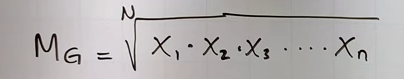

# media Geometrica

¿Cuál tipo de promedio elegiste para trabajar?
- Media Geometrica

¿Qué casos de uso tiene tu tipo de promedio?
- Valoracion de porcentajes y frecuencias relativas

¿Cómo traduces su fórmula a código JavaScript?

- Formula matematicas

donde MG es la media geometriga y n es la cantidad de datos