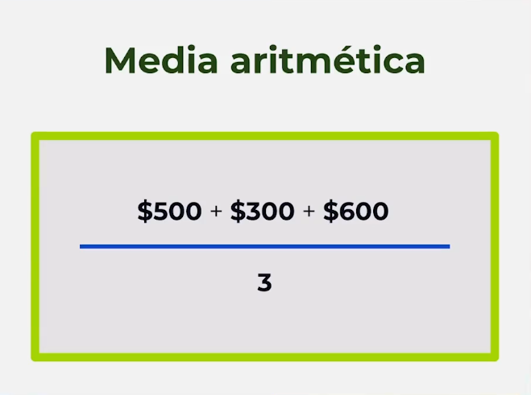
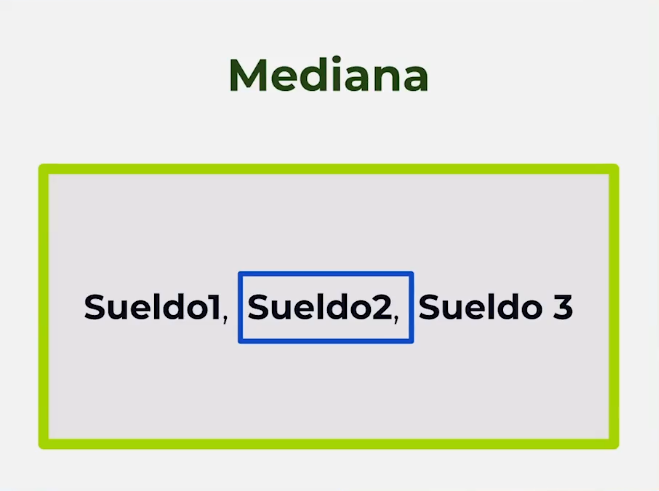
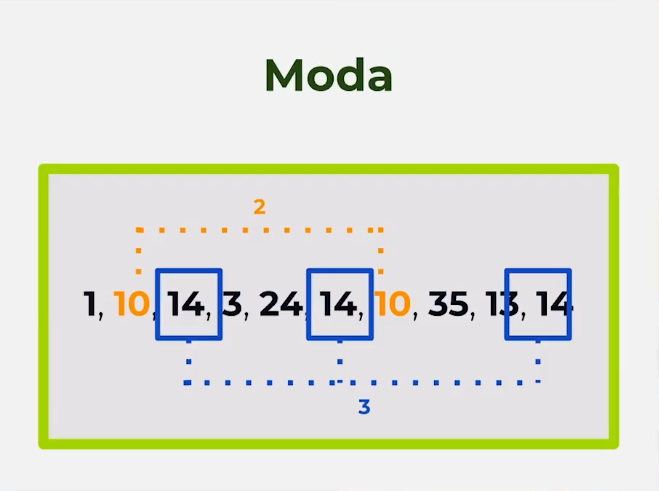

# Taller #3: Promedio Moda Meidana

...

- Primer paso: Definir las formulas
<h2>promerio o media aritmetica</h2>

<h2>Mediana</h2>

<h2>Moda</h2>

- Segndo paso: definir la formula en javascript
- Tercer psao: crear funciones
- Cuarto paso: integrar JS con HTML